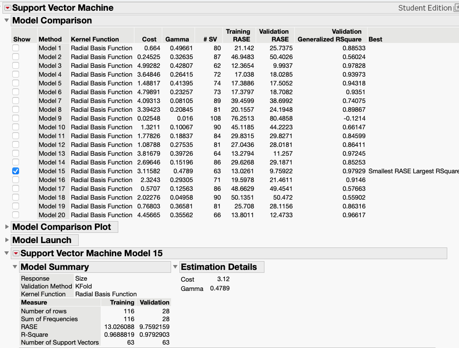

# 🔬 Structure–Activity Modeling of mRNA-LNPs

This repository presents statistical analysis and predictive modeling of lipid nanoparticle (LNP) formulations to understand how composition impacts physicochemical properties, biodistribution, and mRNA expression.

Paper Link: https://www.biorxiv.org/content/10.64898/2026.03.20.712457v1.abstract

---

## 🔹 Overview

LNP formulation plays a central role in determining:

- Size
- Polydispersity Index (PDI)
- Zeta potential
- Biodistribution
- mRNA expression

This project uses **JMP-based statistical modeling** to uncover relationships and guide formulation design.

---

## 🔹 System-Level Relationships


*Fig 5. Interrelationships between formulation parameters and outcomes. Formulation acts as the central driver influencing size, PDI, zeta potential, biodistribution, and mRNA expression.*

---

## 🔹 LNP Size Analysis


*Fig 6. Statistical and predictive modeling of LNP size. Significant effects observed from ionizable and helper lipids. Decision trees and SVR capture nonlinear relationships.*

## 🔹 SVM Grid Search and Model Selection




---

## 🔹 Zeta Potential Analysis


*Fig 7. Zeta potential modeling. PEG lipids and helper lipids significantly influence surface charge and stability.*

---

## 🔹 Biodistribution Analysis


*Fig 8. Biodistribution across organs. Significant variation observed across formulations, with potential for tumor-selective targeting.*

---

## 🔹 mRNA Expression Analysis


*Fig 9. mRNA expression levels across organs. Strong formulation-dependent variability and correlation with biodistribution patterns.*

---

## 🔹 Key Contributions

- 📊 ANOVA & Kruskal-Wallis statistical analysis  
- 🌳 Decision Tree modeling (JMP Partition)  
- 🤖 Predictive modeling (SVR)  
- 📈 Interaction profiling between lipid components  
- 🔗 Correlation analysis: Biodistribution ↔ mRNA expression  

---

## 📁 Repository Structure

The repository is organized as follows:

```bash
LNP-Structure-Activity-Modeling/
├── README.md                          # Project overview and documentation
│
├── figures/                           # Figures used in manuscript (Fig 5–9)
│   ├── fig5_overview.png              # System-level relationships
│   ├── fig6_size.png                  # Size analysis (ANOVA, DT, SVR)
│   ├── fig7_zeta.png                  # Zeta potential analysis
│   ├── fig8_biodistribution.png       # Biodistribution across organs
│   ├── fig9_mrna.png                  # mRNA expression analysis
│   ├── SVM_Output.png                 # SVR modeling output
│   └── a.txt                          # Notes / temporary file (optional → remove if not needed)
│
├── jmp_files/                         # JMP analysis files (.jmp)
│   ├── Figure 6abc ANOVA Kruskal SVM size to Formulation.jmp
│   ├── Figure 7ab,s2ab Kruskal Decision Tree Zeta, PDI to Formulation.jmp
│   ├── Figure 7c, s2c SVM PDI, Zeta to formulation.jmp
│   ├── Figure 8ab,10ab,s3a,s4a ANOVA (mRNA, RhB) to (Formulation) per mice.jmp
│   ├── Figure 8c Bar Graph Organ vs RhB.jmp
│   ├── Figure 10c Bar Graph Organ vs mRNA.jmp
│   ├── Figure 9,11,s3b,s4b Decision Tree (Formulation) to (mRNA and RhB).jmp
│   ├── Table 3,4 Kruskal Test (mRNA and RhB) to Formulation.jmp
│   └── Table 5 Correlation (size, pdi, zeta) to (mRNA, RhB).jmp

