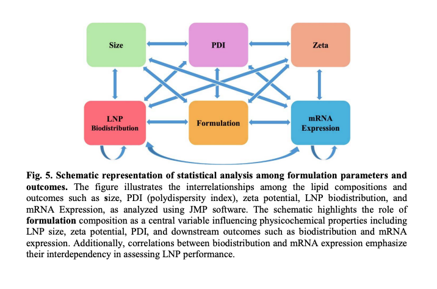
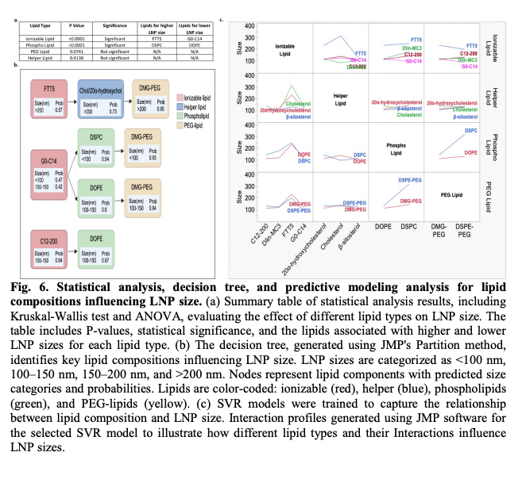
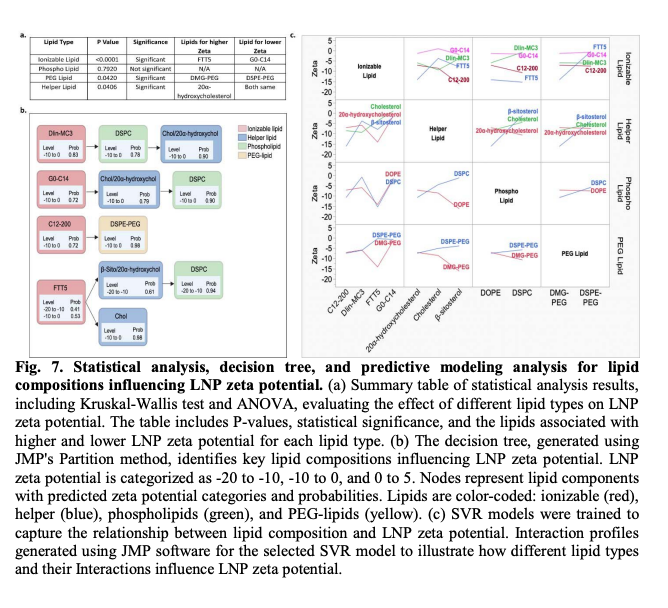
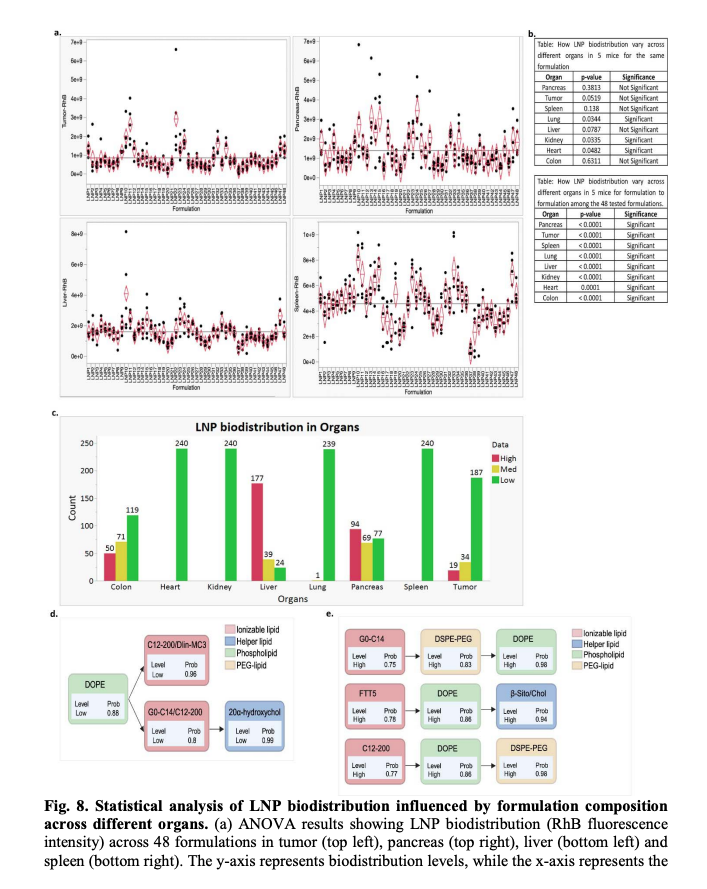
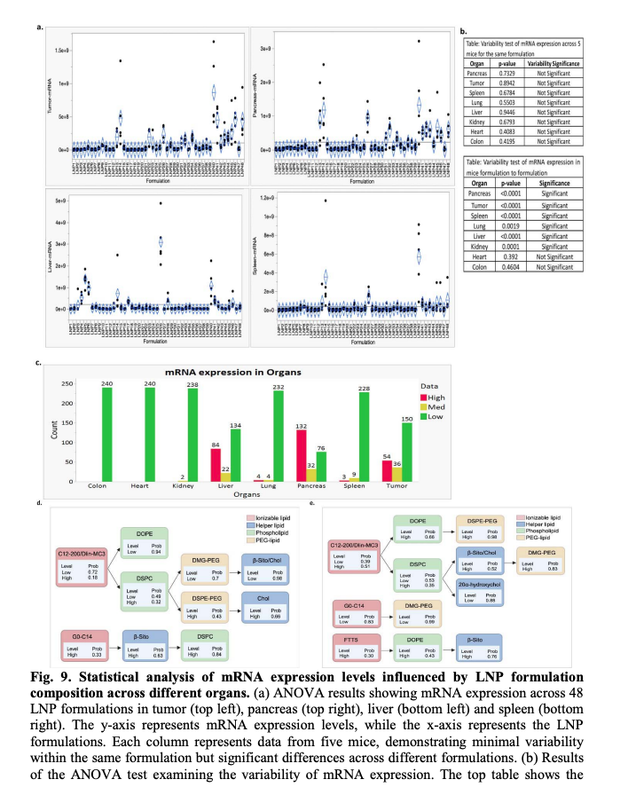

# 🔬 Structure–Activity Modeling of mRNA-LNPs

This repository presents statistical analysis and predictive modeling of lipid nanoparticle (LNP) formulations to understand how composition impacts physicochemical properties, biodistribution, and mRNA expression.
Paper Link: https://www.biorxiv.org/content/10.64898/2026.03.20.712457v1.abstract

---

## 🔹 Overview

LNP formulation plays a central role in determining:

- Size
- Polydispersity Index (PDI)
- Zeta potential
- Biodistribution
- mRNA expression

This project uses **JMP-based statistical modeling** to uncover relationships and guide formulation design.

---

## 🔹 System-Level Relationships

*Fig 5. Interrelationships between formulation parameters and outcomes. Formulation acts as the central driver influencing size, PDI, zeta potential, biodistribution, and mRNA expression.*

---

## 🔹 LNP Size Analysis

*Fig 6. Statistical and predictive modeling of LNP size. Significant effects observed from ionizable and helper lipids. Decision trees and SVR capture nonlinear relationships.*

---

## 🔹 Zeta Potential Analysis

*Fig 7. Zeta potential modeling. PEG lipids and helper lipids significantly influence surface charge and stability.*

---

## 🔹 Biodistribution Analysis

*Fig 8. Biodistribution across organs. Significant variation observed across formulations, with potential for tumor-selective targeting.*

---

## 🔹 mRNA Expression Analysis

*Fig 9. mRNA expression levels across organs. Strong formulation-dependent variability and correlation with biodistribution patterns.*

---

## 🔹 Key Contributions

- 📊 ANOVA & Kruskal-Wallis statistical analysis  
- 🌳 Decision Tree modeling (JMP Partition)  
- 🤖 Predictive modeling (SVR)  
- 📈 Interaction profiling between lipid components  
- 🔗 Correlation analysis: Biodistribution ↔ mRNA expression  

---

## 🔹 Repository Structure
